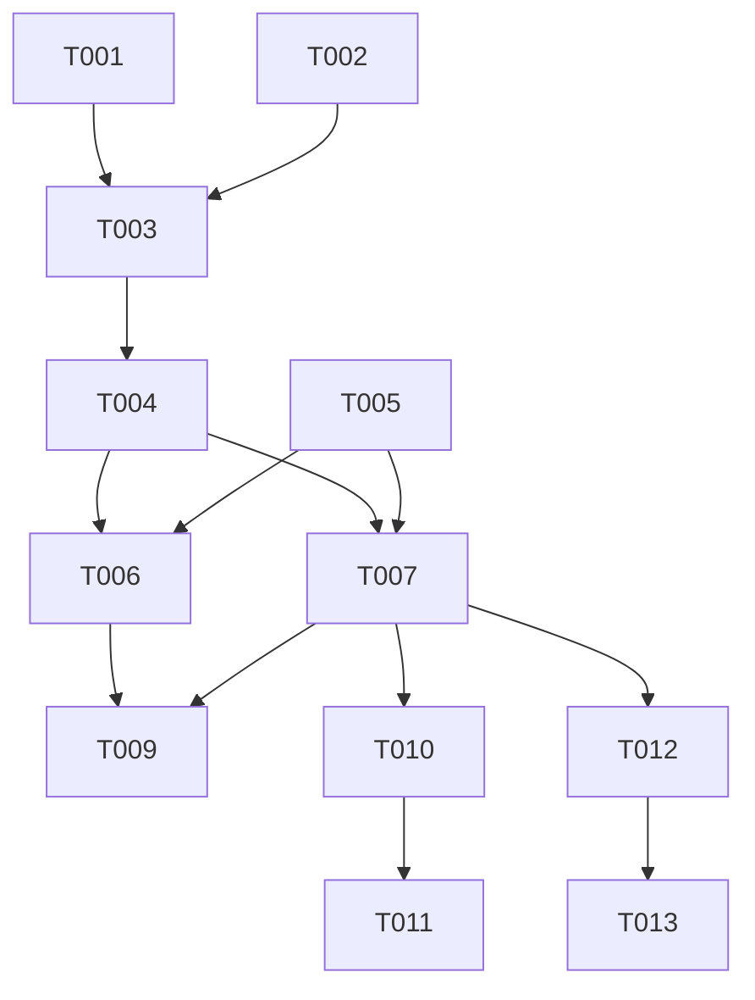

# Tasks: URL State Codec System

**Feature**: `002-url-state-codec`
**Status**: Implemented (Tests Skipped)
**Total Tasks**: 14 (11 completed, 3 test tasks skipped)

## Phase 1: Setup

_Goal: Initialize project structure and dependencies_

- [x] T001 Install dependencies (lz-string, zod) in package.json
- [x] T002 Create project structure for entities and features (src/entities/invoice, src/features/invoice-codec)

## Phase 2: Foundational

_Goal: Define core data models and validation rules_

- [x] T003 Create InvoiceSchemaV1 interface in src/entities/invoice/model/schema.ts
- [x] T004 Create Zod validation schemas in src/entities/invoice/lib/validation.ts

## Phase 3: User Story 1 - Create and Share Invoice URL (P1)

_Goal: Enable generating and reading invoice URLs_
_Independent Test_: Create an invoice, generate URL, open in new tab, verify data matches.

- [x] T005 [P] [US1] Create compression utility in src/shared/lib/compression/index.ts
- [x] T006 [US1] Implement URL encoding logic in src/features/invoice-codec/lib/encode.ts
- [x] T007 [US1] Implement URL decoding logic in src/features/invoice-codec/lib/decode.ts
- [x] T008 [US1] Create public API barrel file in src/features/invoice-codec/index.ts
- [ ] T009 [US1] Create round-trip tests in src/features/invoice-codec/test/codec.test.ts

## Phase 4: User Story 2 - Future-Proof Invoice URLs (P1)

_Goal: Ensure backward compatibility and versioning_
_Independent Test_: Verify v1 parser works with simulated future schema versions.

- [x] T010 [US2] Add version-specific parsing logic in src/features/invoice-codec/lib/decode.ts
- [ ] T011 [US2] Add forward compatibility tests in src/features/invoice-codec/test/versioning.test.ts

## Phase 5: User Story 3 - Validate Invoice Data Integrity (P2)

_Goal: Prevent malformed or invalid data from being displayed_
_Independent Test_: Attempt to parse invalid/corrupted URLs and verify error messages.

- [x] T012 [US3] Integrate Zod validation into decoding pipeline in src/features/invoice-codec/lib/decode.ts
- [ ] T013 [US3] Create validation and limit tests in src/features/invoice-codec/test/limits.test.ts

## Phase 6: Polish & Cross-Cutting Concerns

_Goal: Final verification and cleanup_

- [x] T014 Verify all exports and types in src/features/invoice-codec/index.ts

## Dependencies

## Implementation Strategy

1.  **MVP (US1)**: Focus on getting the basic encode/decode loop working with the V1 schema.
2.  **Robustness (US2 & US3)**: Add versioning support and strict validation to ensure data integrity and future-proofing.
3.  **Testing**: Write tests alongside implementation to verify limits (2000 bytes) and correctness.
